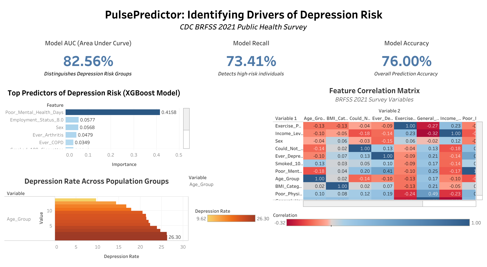

<h1 align="center">🧠 PulsePredictor</h1>

<p align="center">
  <strong>Predicting Depression Risk from Lifestyle & Demographic Data</strong>
</p>

<p align="center">
  
  
  
  
  
</p>

---

## 🌐 Interactive Dashboard

<p align="center">
  <a href="https://public.tableau.com/views/PulsePredictor_Dashboard_twbx/Dashboard1">
    
  </a>
</p>

<p align="center">
  🔗 <a href="https://public.tableau.com/views/PulsePredictor_Dashboard_twbx/Dashboard1"><strong>Click to View Live Interactive Dashboard</strong></a>
</p>

---

## 📌 Project Overview

**PulsePredictor** analyzes large-scale public health survey data to identify key health, demographic, and lifestyle factors associated with depression risk.

Using the **CDC Behavioral Risk Factor Surveillance System (BRFSS) 2021** data which is one of the largest health surveys in the world , PulsePredictor builds interpretable machine learning models and translates findings into an interactive Tableau dashboard designed for healthcare analysts, public health researchers, and policy decision-makers.

The project demonstrates a complete analytics pipeline, from raw survey data ingestion and exploratory analysis, through feature selection and predictive modeling, to visualization of insights for real-world decision support.

---

## 🏥 Core Domain

| Area | Details |
|------|---------|
| **Domain** | Public Health & Mental Health Informatics |
| **Dataset** | CDC BRFSS 2021 |
| **Population** | 438,693 U.S. residents surveyed |
| **Final Dataset** | 262,716 respondents × 28 variables |
| **Target Variable** | Ever diagnosed with depressive disorder (Yes/No) |
| **Best Model** | XGBoost — AUC 0.826 |

---

## ✨ Project Highlights

- 📊 Analyzed **438,693** U.S. health survey respondents
- 🔬 Examined **28** health, demographic, and lifestyle indicators
- 🤖 Trained and compared **4 machine learning models**
- 🏆 Achieved **AUC of 0.826** with XGBoost
- 📈 Delivered findings through an **interactive Tableau dashboard**

---

## 🔄 Data Science Pipeline

```
📥 Data Acquisition       →    Load BRFSS 2021 (.XPT format)
🧹 Data Preparation       →    Variable selection, missing values, feature transformation
🔍 Exploratory Analysis   →    Statistical analysis & visualization
⚙️  Feature Selection      →    Boruta + Recursive Feature Elimination (RFE)
🤖 Machine Learning       →    Logistic Regression, Random Forest, KNN, XGBoost
📊 Model Evaluation       →    AUC, Precision, Recall, F1 Score
🎯 Visualization          →    Interactive Tableau dashboard for stakeholders
```

---

## 📓 Notebooks

| Notebook | Description |
|----------|-------------|
| [`01_load_and_extract.ipynb`](notebooks/01_load_and_extract.ipynb) | Loads BRFSS dataset, converts XPT to CSV, initial inspection |
| [`02_eda.ipynb`](notebooks/02_eda.ipynb) | Data cleaning, correlation analysis, visualization of key predictors |
| [`03_modelling_notebook_v1.0.ipynb`](notebooks/03_modelling_notebook_v1.0.ipynb) | Feature selection, model training, comparison & evaluation |

---

## 🏆 Model Performance

| Model | AUC | Recall | Precision |
|-------|-----|--------|-----------|
| Logistic Regression | 0.780 | 0.66 | 0.41 |
| Random Forest | 0.810 | 0.71 | 0.43 |
| KNN | 0.740 | 0.62 | 0.39 |
| **XGBoost** ⭐ | **0.826** | **0.734** | **0.443** |

> XGBoost achieved the strongest performance and was selected as the final model.

---

## 💡 Key Insights

- 🧠 **Poor mental health days** reported in the past month showed the strongest association with depression risk
- ❤️ **General and physical health status** were strongly correlated with depression outcomes
- 💰 **Socioeconomic factors** — income level and healthcare affordability — significantly influence depression prevalence
- 👥 **Demographic patterns** show higher depression rates among younger adults and females
- 🚬 **Lifestyle factors** including smoking and lack of exercise demonstrate measurable associations with depression risk

---

## 📁 Project Structure

```
PulsePredictor/
│
├── data/
│   ├── raw/                        # README with CDC data source link
│   └── processed/
│       ├── y_train.csv
│       └── y_test.csv
│
├── notebooks/
│   ├── 01_load_and_extract.ipynb
│   ├── 02_eda.ipynb
│   └── 03_modelling_notebook_v1.0.ipynb
│
├── outputs/
│   ├── figures/                    # EDA and model visualizations
│   ├── tables/                     # Model results
│   └── tableau/
│       └── PulsePredictor_Dashboard.png
│
├── docs/
│   ├── Executive_Summary.pdf
│   └── Insights_Summary_1.0.pdf
│
└── README.md
```

---

## 📄 Documentation

| Document | Description |
|----------|-------------|
| [📄 Executive Summary](docs/Executive_Summary.pdf) | 1-page project summary for non-technical audiences |
| [📄 Insights Summary](docs/Insights_Summary_1.0.pdf) | Key EDA findings and observations |

---

## 🛠️ Tech Stack


---

## 🌍 Potential Impact

PulsePredictor demonstrates how large-scale population health data can support early detection of depression risk. Potential applications include:

- 🏥 Population health monitoring for public health agencies
- 🩺 Early mental health screening in primary care settings
- 🎯 Identifying high-risk demographic groups for targeted interventions
- 📋 Supporting policy decisions related to healthcare accessibility

---

## 🔮 Future Improvements

- Incorporate additional behavioral health indicators
- Experiment with advanced feature engineering techniques
- Explore deep learning approaches for depression prediction
- Integrate predictive models into population health monitoring systems

---

<p align="center">
  <em>Built with 💙 by <a href="https://github.com/IshaMandawkar">Isha Mandawkar</a></em>
</p>
